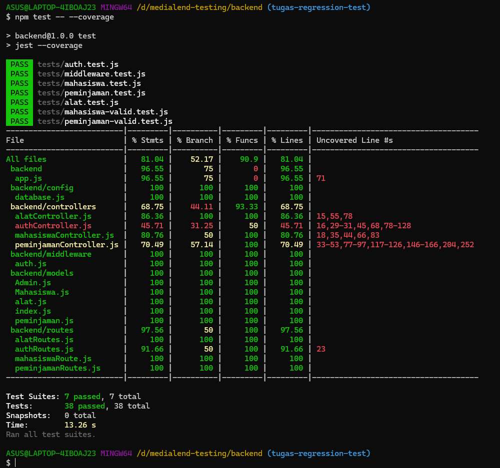

# MediaLend Backend

REST API untuk aplikasi peminjaman alat multimedia kampus.

## Tim Pengembang
- Sri Wahyuningsih A
- Elsa Febriyanti
- Indah Ayu Anastasya

## Teknologi
- Node.js
- Express.js
- Sequelize ORM
- MySQL
- JWT Authentication
- Helmet.js
- Express Rate Limit
- Express Validator

## Fitur API
- Login Mahasiswa
- Login Admin
- CRUD Alat
- CRUD Mahasiswa
- Pengajuan Peminjaman
- Monitoring Peminjaman

## Testing
- Unit Testing
- Security Testing
- Performance Testing (k6)

## Cara Menjalankan

```bash
npm install
npm start
```

## Menjalankan Test

```bash
npm test
```

## Menjalankan Coverage

```bash
npm test -- --coverage
```

## Hasil Pengujian

- Test Suites: 7 Passed
- Total Test Cases: 38 Passed
- Coverage Lines: 81.04%

## Hasil Coverage

Coverage berhasil mencapai target minimal 75%.

- Statements: 81.04%
- Branches: 52.17%
- Functions: 90.90%
- Lines: 81.04%

### Screenshot Coverage



## Demonstrasi Regresi

1. Semua test berhasil dijalankan.
2. Assertion pada test login mahasiswa diubah sehingga test gagal.
3. Regression test berhasil mendeteksi kegagalan.
4. Assertion dikembalikan ke kondisi semula.
5. Seluruh test kembali PASS.

## GitHub Actions

Workflow CI/CD berada pada:

.github/workflows/test.yml

Workflow akan menjalankan:

```bash
npm install
npm test
```

secara otomatis setiap push ke GitHub.